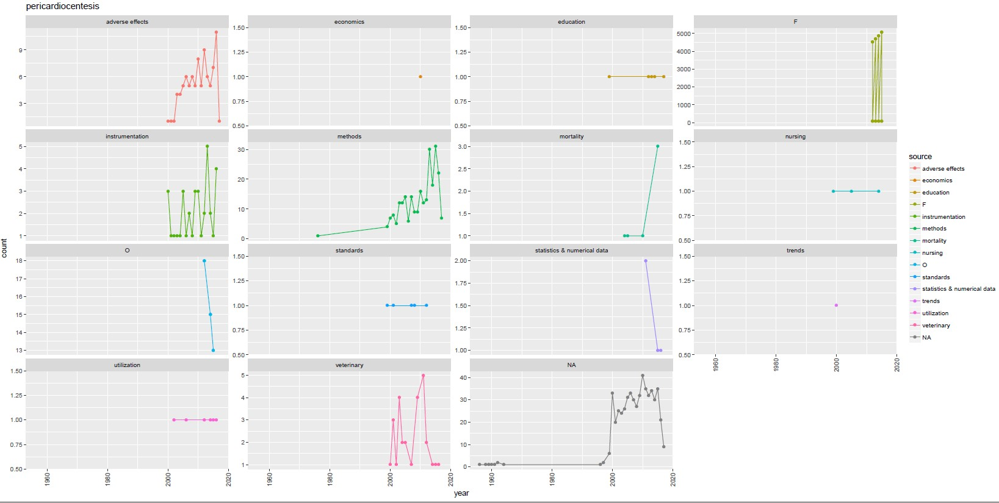

# DataTrends
A repository for a project conducted as an Associate Fellow at the National Library of Medicine

Methods: For data about medical procedures, we extracted annual publication trends from PubMed and real-world usage trends from data.cms.gov. Counts of articles per MeSH (Medical Subject Heading) index term and counts of performed procedures were aggregated by calendar year. First, we analyzed literature trends and real-world data trends in isolation using their respective terminologies: MeSH for PubMed and Healthcare Common Procedure Coding System (HCPCS) for billed medical procedures. A large part of HCPCS terminology consists of a secondary, related procedural terminology called Current Procedural Terminology (CPT). Second, we compared the trends in literature and real-world data for medical procedures where the data was recorded at matching granularity—in other words, where there was a semantic match between MeSH and CPT. Our project repository contains additional methods, result files, and graphs (some of which are referenced below). 

Preliminary results: The PubMed data consisted of 28,211 MeSH keywords (including MeSH Supplemental Concepts) and spanned from 1902 to 2017. We did not include any 2018 data, even though weekly data exists for PubMed, as the incomplete data for the full year would skew our results. The CMS Medicare procedure data (available as Medicare National HCPCS Aggregate Summary Tables) consisted of 50,614 procedures spanning from 2012 to 2015.

We extracted procedure data from the Center for Medicare and Medicaid Services (CMS) at data.cms.gov. We took a dataset of 50,614 medical procedures and constructed an algorithm to create a subset of only 1,160 procedures that demonstrated a 100% increase in use during the investigated period (see [rwd_procs_subset.csv](https://github.com/sheshan93/DataTrends/blob/master/rwd-procs-subset.csv)). Using NLM’s Unified Medical Language System, we identified 2,827 procedures that are mapped to the same UMLS concept (see [mesh-cpt-map.csv](https://github.com/sheshan93/DataTrends/blob/master/mesh-cpt-map.csv)). For example, we were able to compare trends for pericardiocentesis (PubMed MeSH term D020519 and HCPCS codes 33010 and 33011). Literature data for pericardiocentesis spans back to the 1950s with a sharp increase in 2000. Real world data shows an increasing trend from 2012-2015 (see [pericardiocentesis-graph.jpg](https://github.com/sheshan93/DataTrends/blob/master/pericardiocentesis-graph.jpg)). Analyzing the significance of particular trends in literature vs. the real world is a subject of future work of our team.

Limitations: CMS only provides procedural data since 2012, which limits the ability to detect long-term trends. In addition, the Medicare data is comprised mostly of patients over 65 years old, is not normalized (e.g., count of procedures per 10k patients), and is biased by changes in the total Medicare population over time. For medical literature, only articles with assigned MeSH keywords were included in our study.

Graph example

